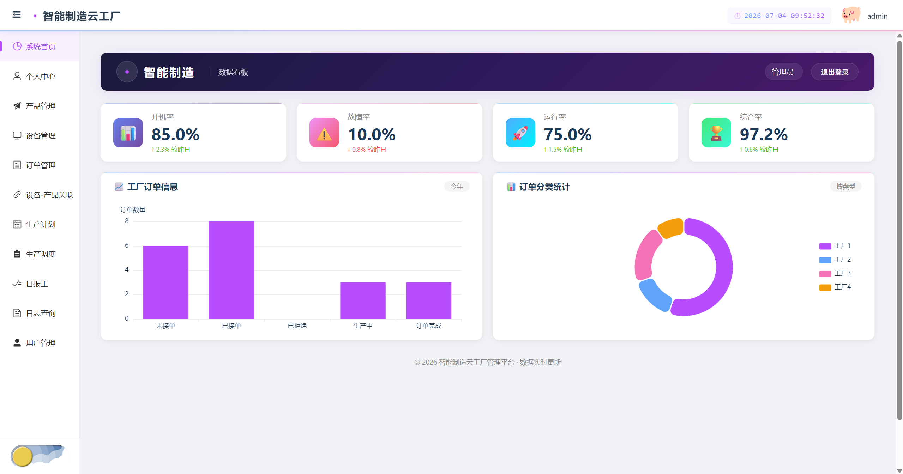
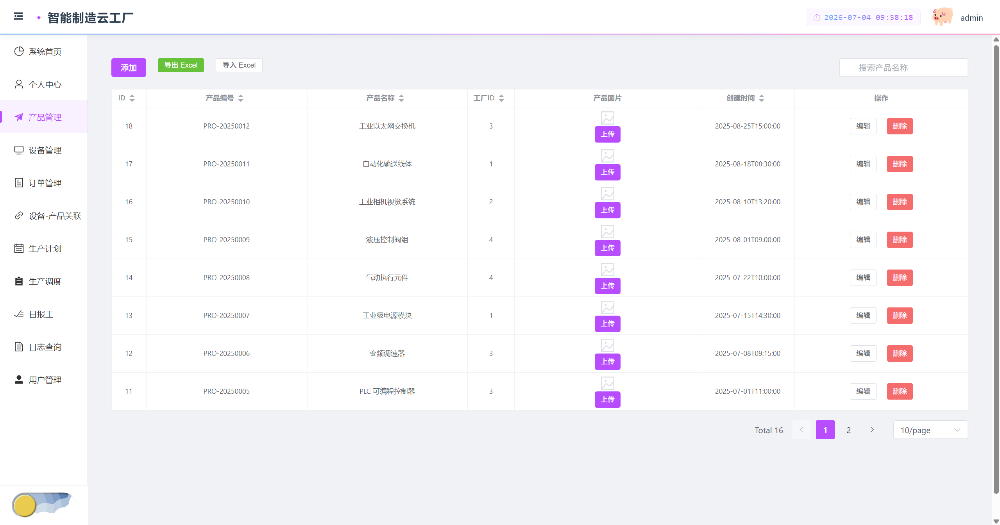
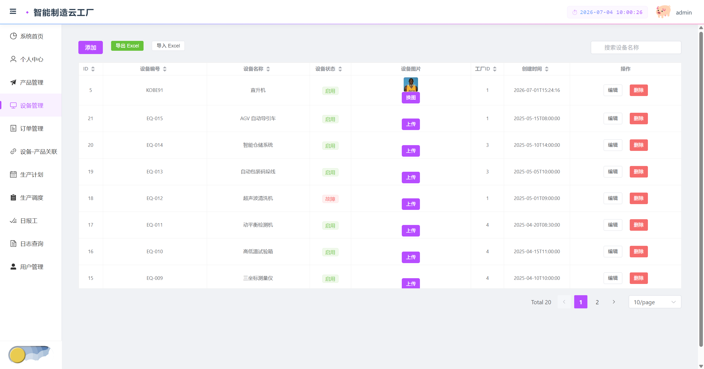
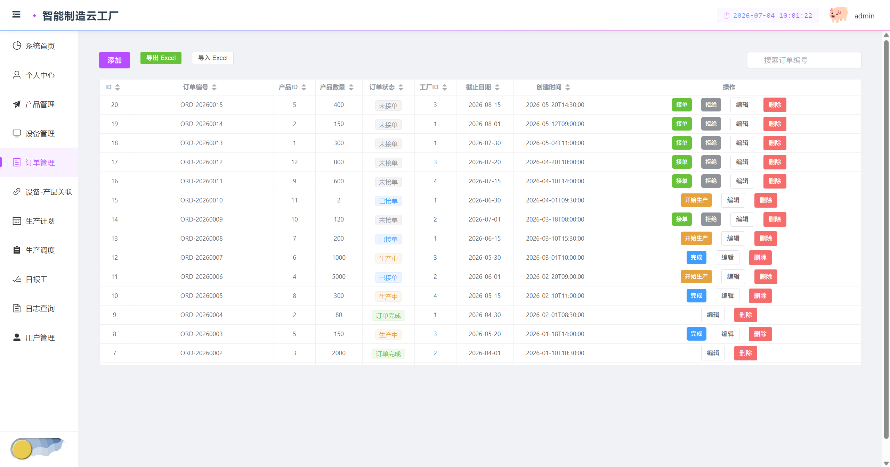
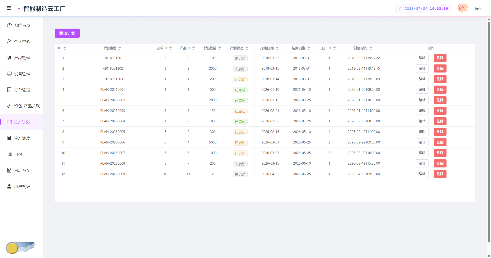
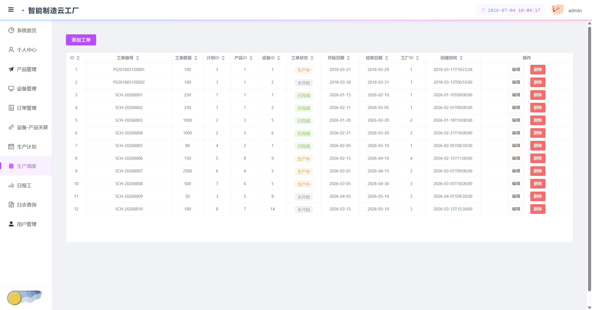
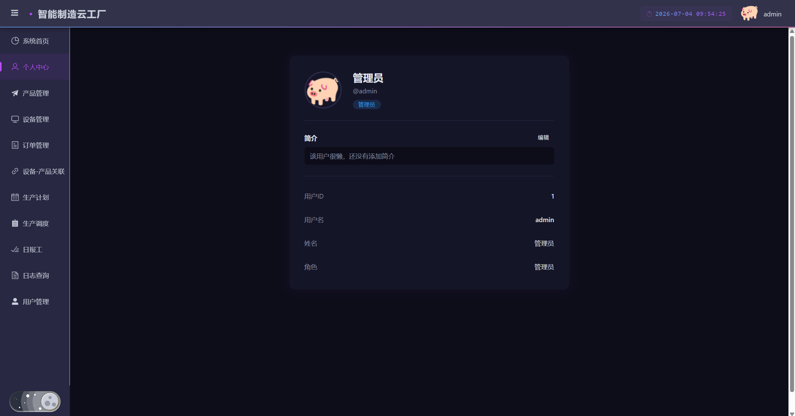
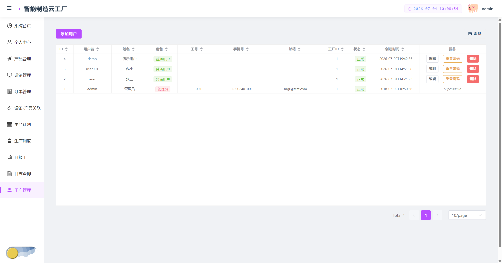
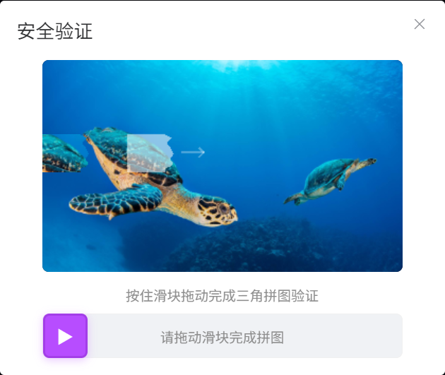

# Smart Factory Cloud — 智能制造云工厂管理平台

基于 **Spring Boot 4 + Vue 3 + MySQL** 的全栈智能制造工厂管理系统，提供工厂日常运营所需的数字化管理能力，覆盖产品、设备、订单、生产计划与调度等核心业务环节。

## 技术栈

| 层级 | 技术 |
|------|------|
| 后端框架 | Spring Boot 4.0.7 (Java 21) |
| ORM | MyBatis (注解式) |
| 数据库 | MySQL 8.4 |
| 前端框架 | Vue 3 + TypeScript |
| UI 组件库 | Element Plus |
| 数据可视化 | ECharts |
| HTTP 通信 | Axios |
| 构建工具 | Maven (后端) + Vite (前端) |
| Excel 处理 | Apache POI 5.2.5 |

## 功能模块

```
Smart Factory Cloud
├── 数据看板           统计卡片 + 订单柱状图 + 工厂饼图
├── 产品管理           CRUD + 图片上传 + 搜索 + 分页 + Excel 导入导出
├── 设备管理           CRUD + 状态标签 + 图片上传 + 搜索 + 分页 + Excel 导入导出
├── 订单管理           CRUD + 状态快捷流转 + 搜索 + Excel 导入导出
├── 设备-产品关联      管理设备产能关联
├── 生产计划           计划 CRUD + 状态流转
├── 生产调度           工单 CRUD + 关联计划/设备
├── 日报工             日报工记录查看 (分页)
├── 用户管理           用户 CRUD + 重置密码 + 角色分配
├── 个人中心           头像管理 + 简介编辑
├── 消息中心           收件箱 + 反馈管理 + 管理员申请审核
├── 意见反馈           2000 字限制 + 附件上传 + 管理员回复
├── 日志查询           业务操作审计 (管理员)
└── 滑块验证码         3 种形状随机 + 边缘凹凸 + 3 次失败刷新
```

## 权限体系

| 角色 | 权限范围 |
|------|----------|
| 超级管理员 (userId=1) | 全部功能 + 用户管理 + 审核管理员申请 |
| 管理员 (roleId=1) | 所有 CRUD + 日志查看 |
| 普通用户 (roleId=2) | 浏览查看 + 提交反馈 + 申请管理员 |

## 快速开始

### 前置条件

- JDK 21+
- Maven 3.8+
- MySQL 8.0+
- Node.js 18+

### 1. 克隆项目

```bash
git clone https://github.com/your-username/smart-factory-cloud.git
cd smart-factory-cloud
```

### 2. 创建数据库

```bash
mysql -u root -p -e "CREATE DATABASE IF NOT EXISTS db_factory CHARACTER SET utf8mb4"
```

### 3. 导入演示数据（可选，推荐）

```bash
mysql -u root -p db_factory < demo_data.sql
```

### 4. 配置数据库连接

编辑 `src/main/resources/application.yaml`，修改数据库密码：

```yaml
password: ${DB_PASSWORD:your_password}
```

### 5. 启动后端

```bash
mvn clean package -DskipTests
mvn spring-boot:run
```

后端运行在 `http://localhost:9999`

### 6. 启动前端

```bash
cd frontend
npm install
npm run dev
```

前端运行在 `http://localhost:8000`

### 7. 访问系统

浏览器打开 `http://localhost:8000`

## 默认账号

| 用户名 | 密码 | 角色 |
|--------|------|------|
| admin | admin123 | 超级管理员 |
| user | user123 | 普通用户 |
| demo | demo123 | 普通用户 (需导入演示数据) |

## 项目结构

```
smart-factory-cloud/
├── pom.xml                      Maven 构建文件
├── demo_data.sql                演示数据脚本
├── src/
│   └── main/
│       ├── java/.../changshademo/
│       │   ├── config/          配置 (Security, Web, Cors, DataInitializer)
│       │   ├── controller/      REST 控制器
│       │   ├── service/         业务逻辑
│       │   ├── mapper/          MyBatis 数据访问
│       │   ├── entity/          实体模型
│       │   ├── dto/             数据传输对象
│       │   ├── enums/           枚举 (订单/设备/计划等状态)
│       │   ├── common/          通用工具 (Result, PageResult)
│       │   ├── captcha/         滑块验证码
│       │   └── utils/           日志工具
│       └── resources/
│           ├── application.yaml 配置文件
│           ├── captcha-images/  验证码背景图片
│           └── db/migration/    Flyway 迁移脚本
├── frontend/
│   ├── src/
│   │   ├── views/              页面组件
│   │   ├── components/         通用组件
│   │   ├── api/                 API 调用层
│   │   ├── router/             路由配置
│   │   ├── store/              Vuex 状态管理
│   │   └── assets/             静态资源 (CSS, 图片, 图标)
│   └── package.json
└── uploads/                    文件上传目录 (运行时生成)
```

## 数据库表

| 表名 | 说明 |
|------|------|
| t_user | 用户 |
| t_factory | 工厂 |
| t_product | 产品 |
| t_equipment | 设备 |
| t_product_order | 订单 |
| t_product_plan | 生产计划 |
| t_product_schedule | 生产调度 |
| t_daily_work | 日报工 |
| t_equipment_product | 设备-产品关联 |
| t_business_log | 业务操作日志 |
| t_feedback | 用户反馈 |
| t_admin_application | 管理员申请 |
| t_message | 消息 |
| t_user_avatar_history | 头像历史 |

## 截图

  | 功能 | 预览 |
  |------|------|
  | 数据看板 |  |
  | 产品管理 |  |
  | 设备管理 |  |
  | 订单管理 |  |
  | 生产计划 |  |
  | 生产调度 |  |
  | 个人中心 |  |
  | 用户管理 |  |
  | 滑块验证码 |  |

## Release Notes

### v1.0.0

首个正式版本，完整实现工厂管理系统核心功能，详见 [Releases](https://github.com/Amazing-ikun/smart-factory-cloud/releases)。

## License

MIT
